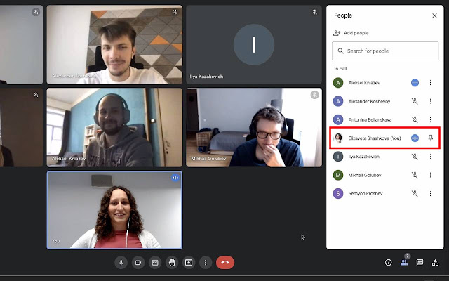

## Sort the Meet

Show yourself in alphabetical order in participants list

By default, when you open a list of participants in Google Meet, all the participants are shown in alphabetical order except of you. You're always shown on top of the list and it's hard to understand when is your turn to speak.
Sort the Meet extension solves this problem and shows you not on top of the list, but in the correct alphabetical position.

The extension can be installed from the [Chrome Web Store](https://chrome.google.com/webstore/detail/sort-the-meet/dokbaedihaiifdlfgbeillibkpngoikg)

## Getting Started

Steps for installing the extension manually:

1. Open `chrome://extensions/` in Google Chrome
2. Enable **Developer Mode**
3. Click **Load Unpacked**, select the folder with the contents of the current repository and start using!
